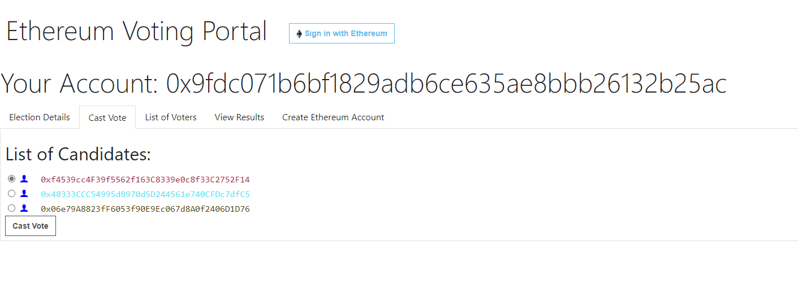

# BTP | Group B21RP01

Ashutosh Chauhan S20180010017
Vitthal Inani S20180010193
Mani Rajeev S20180010072
Valluri Deepak S20170010171

# Setting up Project
1. Download and Install [Ganache](https://trufflesuite.com/ganache/)
2. Open Ganache and create a new Network
   
3. Install [MetaMask Extension](https://metamask.io/) in Google Chrome.
4. Install [NodeJS](https://nodejs.org/en/)
5. Copy project contents to a directory.
6. Open a terminal in the directory and run the following commands:
   ```sh
   npm install
   truffle build
   truffle migrate
   npm run frontend
   ```
7. Open another terminal in the same directory and run the following commands:
   ```sh
   truffle console
   const e = Election.deployed()
   e.initiateElection() // The election will start and accept user votes
   e.concludeVoting() // The voting will stop and the Contract will not accept votes
   e.revealPrivateKey("<public key>") 
   e.concludeElection() // The results will be public
   ```

Screenshots:




